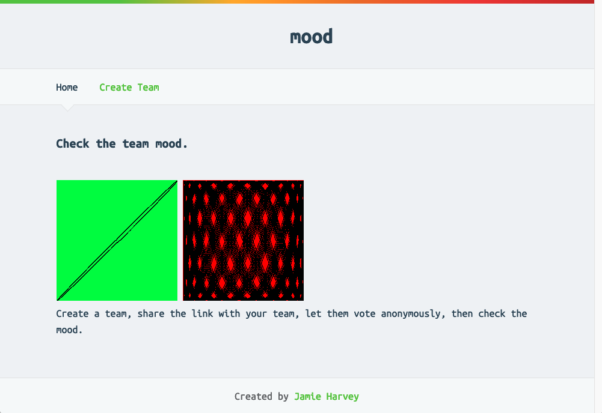

# mood

This is a Golang web application that allows a team to anonymously vote and get a sense of the "team mood".

The mood is represented by a lissajous gif that will be green and calm for teams in a good mood and red and chaotic for teams in a bad mood.
The mood will normalize over time without any input. 

There will be a `Vote` link on the team view page to go to the vote form.
To vote a user will select one of 5 emojis corresponding to happiness.
This will raise or lower the score and affect the gif when viewed.

## How to setup
### With Docker and sqlite
1. Clone or fork repository
2. Run `docker build -t mood .`
3. Run `docker run -p 8080:8080 mood`
4. Visit http://localhost:8080/

### With MySQL
1. Set `DATABASE_HOST`, `DATABASE_USERNAME`, and `DATABASE_PASSWORD` as environment variables.
2. While logged into MySQL run `source scripts/database/mood-mysql.sql` to create the database and tables.
3. Run mood with the `--database=mysql` flag.

## To Do
- Unique IP cannot vote twice within an hour
- Ability to create a team that requires a password to vote
- Testing
- Unique team names
- Implement search by team name for view
